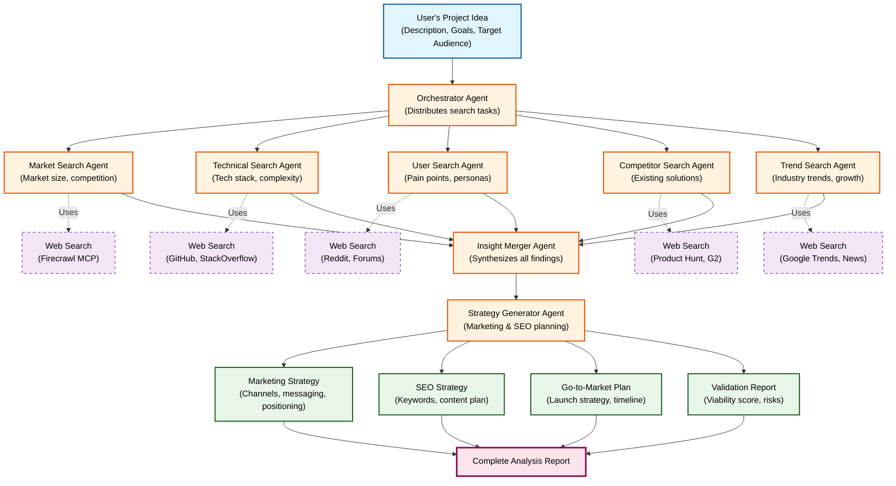

# Side Project Idea Analysis Workflow

## Overview
This workflow analyzes a side project idea using an orchestrator agent that distributes search tasks to multiple search agents working in parallel with web search capabilities, then merges insights to generate comprehensive marketing and SEO strategies.

## Workflow Architecture

